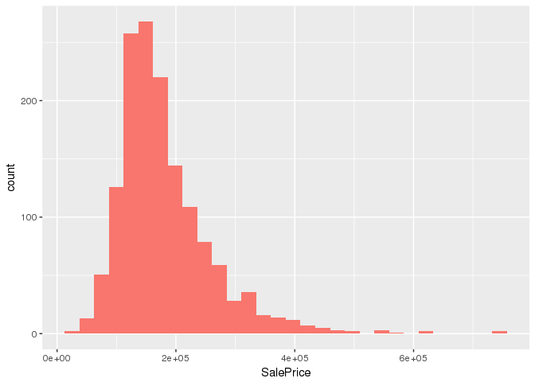
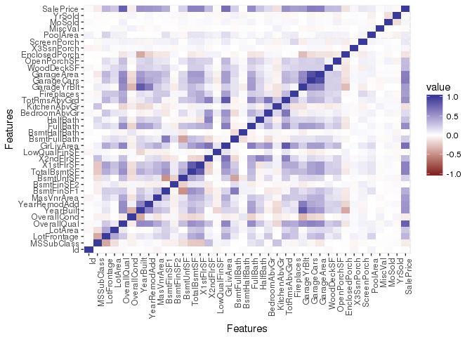

Overview
--------

In this post I will be doing simple exploratory data analysis of the [Ames Housing dataset](https://ww2.amstat.org/publications/jse/v19n3/decock.pdf) used in the Kaggle competition [House Prices: Advanced Regression Techniques](https://www.kaggle.com/c/house-prices-advanced-regression-techniques). This is my first blog post here so it's also an exercise in creating blog posts!

### Aims

The problem is to try to correctly predict the house prices in the test dataset by training a regression model on the training data. The dataset to be submitted to Kaggle will have the following form:

|    Id|  SalePrice|
|-----:|----------:|
|  1461|   169277.1|
|  1462|   187758.4|
|  1463|   183583.7|
|  1464|   179317.5|
|  1465|   150730.1|
|  1466|   177151.0|

Analysis
--------

Here I will provide a simple exploratory analysis of the training data. In subsequent posts, I will go into developing the model.

### Columns

Here are the columns available in the dataset:

``` r
names(train)
```

    ##  [1] "Id"            "MSSubClass"    "MSZoning"      "LotFrontage"  
    ##  [5] "LotArea"       "Street"        "Alley"         "LotShape"     
    ##  [9] "LandContour"   "Utilities"     "LotConfig"     "LandSlope"    
    ## [13] "Neighborhood"  "Condition1"    "Condition2"    "BldgType"     
    ## [17] "HouseStyle"    "OverallQual"   "OverallCond"   "YearBuilt"    
    ## [21] "YearRemodAdd"  "RoofStyle"     "RoofMatl"      "Exterior1st"  
    ## [25] "Exterior2nd"   "MasVnrType"    "MasVnrArea"    "ExterQual"    
    ## [29] "ExterCond"     "Foundation"    "BsmtQual"      "BsmtCond"     
    ## [33] "BsmtExposure"  "BsmtFinType1"  "BsmtFinSF1"    "BsmtFinType2" 
    ## [37] "BsmtFinSF2"    "BsmtUnfSF"     "TotalBsmtSF"   "Heating"      
    ## [41] "HeatingQC"     "CentralAir"    "Electrical"    "X1stFlrSF"    
    ## [45] "X2ndFlrSF"     "LowQualFinSF"  "GrLivArea"     "BsmtFullBath" 
    ## [49] "BsmtHalfBath"  "FullBath"      "HalfBath"      "BedroomAbvGr" 
    ## [53] "KitchenAbvGr"  "KitchenQual"   "TotRmsAbvGrd"  "Functional"   
    ## [57] "Fireplaces"    "FireplaceQu"   "GarageType"    "GarageYrBlt"  
    ## [61] "GarageFinish"  "GarageCars"    "GarageArea"    "GarageQual"   
    ## [65] "GarageCond"    "PavedDrive"    "WoodDeckSF"    "OpenPorchSF"  
    ## [69] "EnclosedPorch" "X3SsnPorch"    "ScreenPorch"   "PoolArea"     
    ## [73] "PoolQC"        "Fence"         "MiscFeature"   "MiscVal"      
    ## [77] "MoSold"        "YrSold"        "SaleType"      "SaleCondition"
    ## [81] "SalePrice"

The last column "SalePrice" is the one we will be measuring. There are 80 other features that we should try to make use of to predict SalePrice.

### Distribution of house prices

First things first, let's look at how the house prices are distributed.

``` r
sp <- train %>% select(SalePrice)
ggplot(sp, aes(SalePrice, fill='1')) + geom_histogram() + guides(fill=FALSE)
```

    ## `stat_bin()` using `bins = 30`. Pick better value with `binwidth`.



We can see that the distribution is not normal. It has a positive skew.

``` r
sp %>% summarise(Skewness = skewness(SalePrice), Kurtosis = kurtosis(SalePrice))
```

    ##   Skewness Kurtosis
    ## 1 1.880941 9.509812

### Feature correlation

``` r
corrdata <- train %>% select(which(sapply(.,is.numeric)))
qplot(x=Var1, y=Var2, data=melt(cor(corrdata, use="p")), fill=value, geom="tile") +
  scale_fill_gradient2(limits=c(-1, 1)) +
  theme(axis.text.x = element_text(angle = 90, hjust = 1)) +
  labs(x = 'Features', y = 'Features')
```


